# Control Tutorial

A step-by-step guide to building diagrams with `control`, progressing from simple boxes to full-featured diagrams.

**Quick start:**

```
control --diagram input.txt --out output.svg
```

---

## 1. Basics

The simplest diagram: two boxes connected by an arrow. Each box has an **ID**, a **grid position** (`x,y`), and a **label**.

```
A: 1,1: Box A
B: 4,1: Box B
---
A -> B
```

Arrows are defined after the `---` separator using `ID -> ID` syntax.

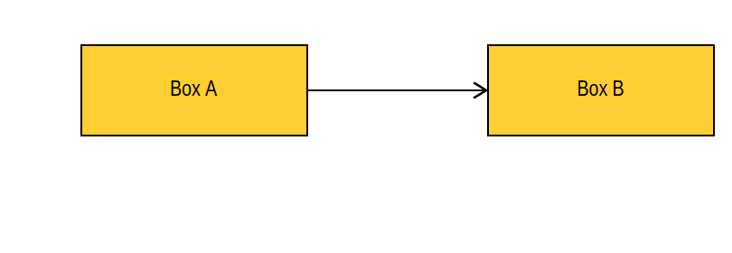

---

## 2. Relative Positioning & Auto-Arrows

Use `>` to create an **auto-arrow** from the previous box and position relative to it with `+`/`-` offsets.

```
A: 1,1: Start
B: >+2,0: Step 1
C: >+2,0: Step 2
D: >0,+2: Step 3
E: >-2,0: Step 4
F: >-2,0: End
```

| Syntax | Meaning |
|--------|---------|
| `>+2,0` | Arrow from previous, 2 right |
| `>0,+2` | Arrow from previous, 2 down |
| `>-2,0` | Arrow from previous, 2 left |

No `---` section needed when all arrows are auto-generated.

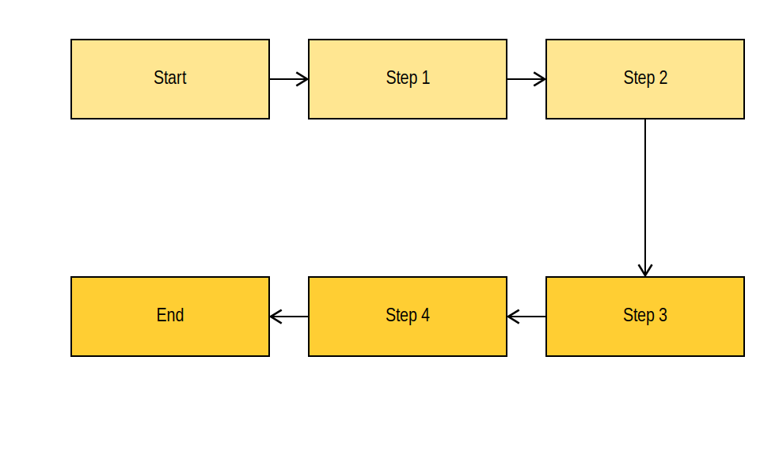

---

## 3. Sizing

Control box width and height with extra parameters after the coordinates.

```
A: 1,1: Default
B: 3,1,2: Width 2
C: 6,1,1,2: Height 2
D: 1,3,3: Width 3
E: 5,3,2,2: Both
F: 8,3,3/4: 3/4
```

| Format | Meaning |
|--------|---------|
| `x,y` | Default size (1x1) |
| `x,y,w` | Custom width |
| `x,y,w,h` | Custom width and height |
| `3/4` | Fractional sizes supported |

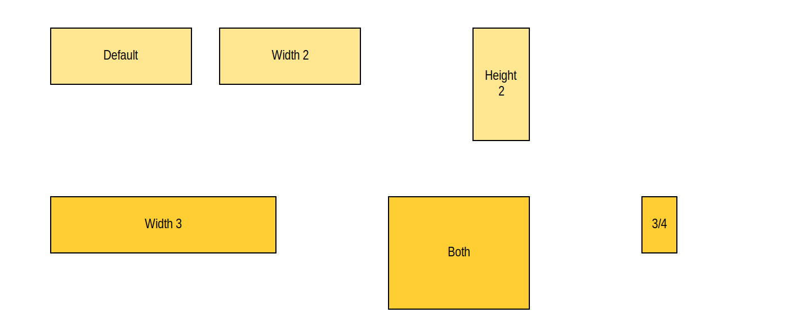

---

## 4. Manual Arrows

Define arrows explicitly in the `---` section. Arrows route automatically, including backward and diagonal paths.

```
A: 1,1: Input
B: 4,1: Process
C: 7,1: Output
D: 4,3: Review
---
A -> B
B -> C
C -> D
D -> A
```

The arrow router picks the best path to avoid overlapping boxes.

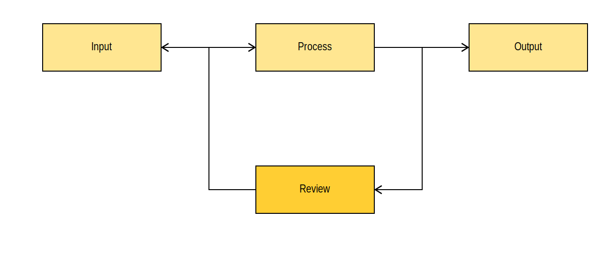

---

## 5. Built-in Styles

Add style codes after the label, separated by a comma. Combine multiple styles with `-`.

```
A: 1,1: Gray, g
B: 3,1: Purple, p
C: 5,1: Light Purple, lp
D: 1,3: Red Border, rb
E: 3,3: Red Text, rt
F: 5,3: No Border, nbb
G: 1,5: Double Text, 2t
H: 4,5: Combined, g-rb
```

| Code | Effect |
|------|--------|
| `g` | Gray background |
| `p` | Purple background |
| `lp` | Light purple background |
| `rb` | Red border (3px) |
| `rt` | Red text |
| `nbb` | No border, no background |
| `2t` | Double text size |
| `g-rb` | Gray background + red border |

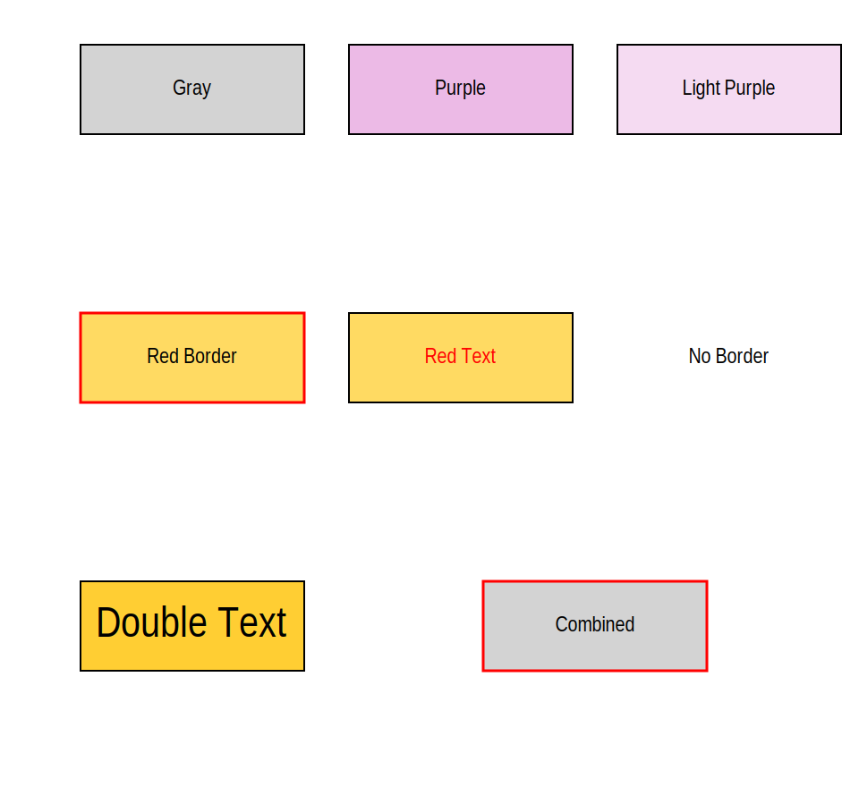

---

## 6. Custom Colors

Define custom colors in the **frontmatter** (between `---` markers at the top). Use the color name as a style, or append `t` for text color.

```
---
color: blue = #3B82F6
color: green = #22C55E
---
A: 1,1: Blue, blue
B: 3,1: Blue Text, bluet
C: 5,1: Green, green
D: 7,1: Green Text, greent
```

| Syntax | Effect |
|--------|--------|
| `blue` | Blue background |
| `bluet` | Blue text |
| `blue-greent` | Blue background + green text |

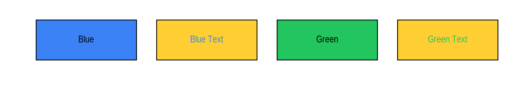

---

## 7. Touch-Left

The `|` prefix positions a box so its left edge touches the previous box. Useful for adjacent elements on the same row.

```
A: 1,1: Main
|+2,0: Side A
|+2,0: Side B
B: 1,3: Base
|+3,0: Extension
```

Touch-left requires:
- Relative X with `+` prefix
- Y must be `0` (same row as previous box)

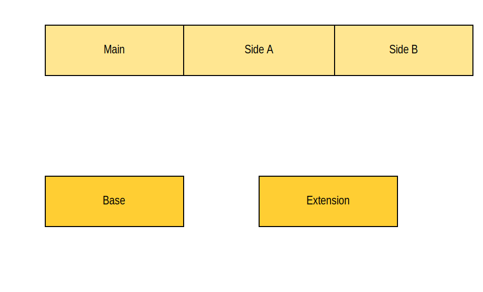

---

## 8. Groups

Groups add a colored background behind related boxes. Define groups with `@Name: Label`, then tag boxes with `@Name`.

```
@Dev: Development
@Ops: Operations

A: 1,1: Frontend @Dev
B: 3,1: Backend @Dev
C: 6,1: Deploy @Ops
D: 8,1: Monitor @Ops
---
A -> B
B -> C
C -> D
```

Each group automatically gets a distinct background color and label.

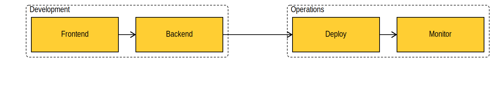

---

## 9. Containers

Containers group boxes with a shared coordinate offset. Inner boxes use coordinates relative to the container's base position. Arrows inside the container are defined within the `[ ]` block.

```
A: 1,1: Outside

G: 3,2 [
    B: 0,0: Alpha
    C: 2,0: Beta
    D: 0,2: Gamma
    B -> C
]

E: 8,1: External
---
A -> B
D -> E
```

| Syntax | Meaning |
|--------|---------|
| `G: 3,2 [` | Container at base position 3,2 |
| `B: 0,0: Alpha` | Box at container-relative 0,0 (actual: 3,2) |
| `]` | End of container |

Arrows from container boxes to outside boxes go in the main `---` section.

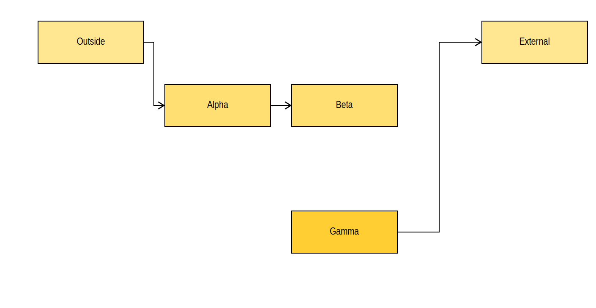

---

## 10. Axes & Legend

The frontmatter supports axis labels and a legend for style codes.

```
---
x-label: Timeline
y-label: Maturity
legend: g=Done
legend: p=Active
legend: lp=Planned
---
A: 1,1: Phase 1, g
B: 3,2: Phase 2, g
C: 5,3: Phase 3, p
D: 7,4: Phase 4, lp
---
A -> B
B -> C
C -> D
```

| Key | Effect |
|-----|--------|
| `x-label` | Label along the horizontal axis |
| `y-label` | Label along the vertical axis |
| `legend` | Maps style codes to descriptions |

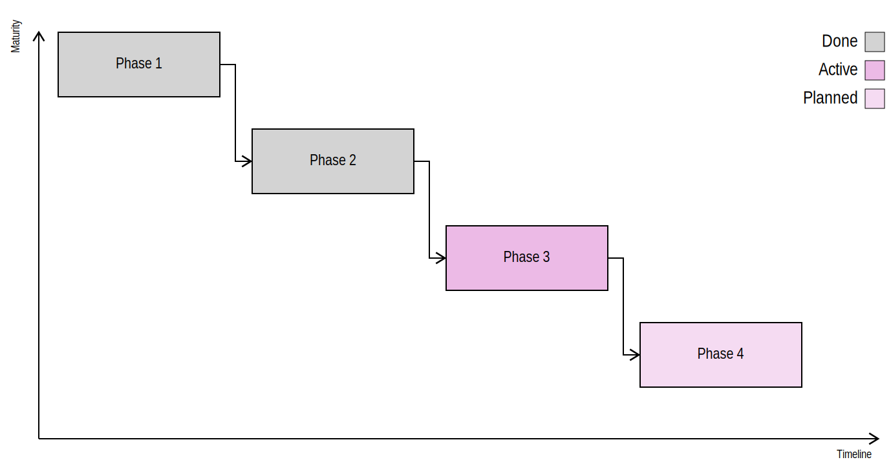

---

## 11. Arrow Flow

Set `arrow-flow: down` in the frontmatter to prefer top-down routing, ideal for org charts and hierarchies.

```
---
arrow-flow: down
---
A: 4,1: CEO
B: 2,3: VP Sales
C: 6,3: VP Eng
D: 1,5: East
E: 3,5: West
F: 5,5: Backend
G: 7,5: Frontend
---
A -> B
A -> C
B -> D
B -> E
C -> F
C -> G
```

Without `arrow-flow: down`, arrows prefer horizontal routing. With it, vertical paths get a scoring bonus.

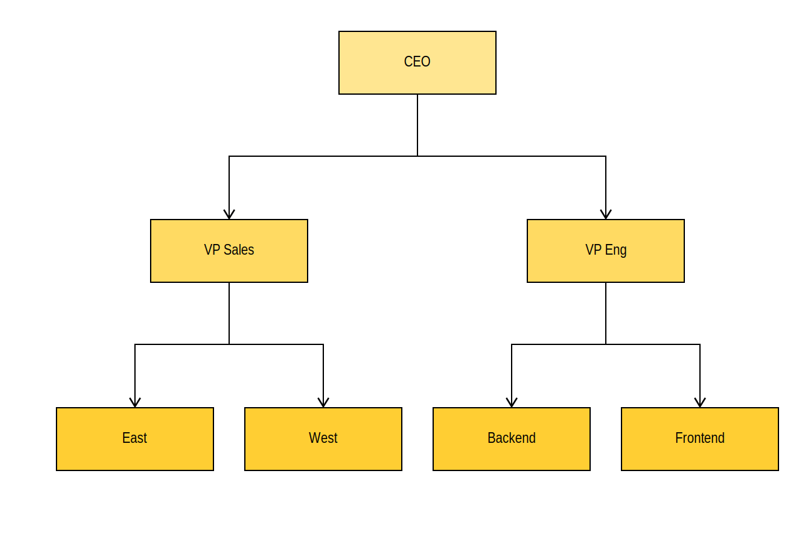

---

## 12. Full Example

Combining frontmatter, custom colors, groups, sizing, styles, and arrows.

```
---
x-label: Sprint Timeline
y-label: Team
color: done = #22C55E
color: active = #3B82F6
legend: done=Completed
legend: active=In Progress
legend: g=Blocked
---
@BE: Backend
@FE: Frontend

A: 3,1,2: Sprint Goal, active

B: 1,3: API, done @BE
C: 3,3: Schema, done @BE
D: 6,3: UI Mockup @FE
E: 8,3: Components @FE

F: 2,5,2: Integration, g
G: 6,5,2: Review, lp
---
A -> B
A -> D
B -> C
C -> F
D -> E
E -> G
F -> G
```

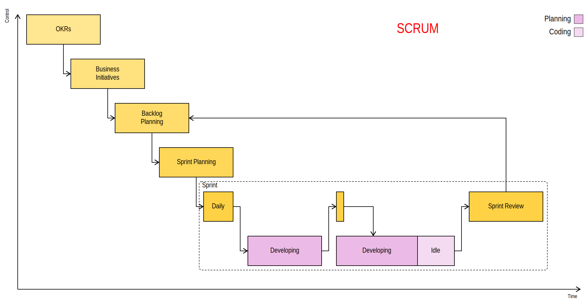

---

## CLI Reference

```
control --diagram input.txt --out output.svg [options]
```

| Flag | Description |
|------|-------------|
| `--diagram` | Input `.txt` file |
| `--out` | Output `.svg` file |
| `--font` | Custom `.woff2` font file |
| `--stretch` | Horizontal stretch factor (e.g. `0.8`) |
| `--debug` | Output debug info to JSON file |
